[](https://insality.github.io/druid/)

[](https://github.com/Insality/druid/tags)
[](https://github.com/Insality/druid/actions)
[](https://codecov.io/gh/Insality/druid)

[](https://github.com/sponsors/insality) [](https://ko-fi.com/insality) [](https://www.buymeacoffee.com/insality)

**Druid** - a powerful, flexible and easy to use **Defold** component UI framework. Contains a wide range of UI components that you can use to create a beautiful, responsive and customizable GUIs. Provides a powerful way to create, compose and manage your custom components and scenes.

## Druid Example

Check the [**HTML5 version**](https://insality.github.io/druid/) of the **Druid** example app.

In this example you can inspect a variety of **Druid** components and see how they work. Each example page provides a direct link to the corresponding example code, making it easier for you to understand how to use **Druid**.

## Features

- **Components Rich** - Provides a extensive set of components, from basic buttons to infinity data lists and rich texts
- **Customizable** - You can customize components appearance and behaviour with their API and styles
- **Widgets** - Powerful way to create your own reusable components
- **Input Handling** - Handles input in a stack-based manner and manage input priority
- **Event Based** - Uses [Defold Event](https://github.com/Insality/defold-event) for components callbacks and communication between components

## Quick Links

- [Basic Usage](wiki/basic_usage.md)
- [Quick API Reference](api/quick_api_reference.md)
- [List of Components](#druid-components)
- [Contributors](#contributors)
## Setup

### [Dependency](https://defold.com/manuals/libraries/#setting-up-library-dependencies)

Open your `game.project` file and add the following lines to the dependencies field under the project section:


**[Druid](https://github.com/Insality/druid/)**

```
https://github.com/Insality/druid/archive/refs/tags/1.1.6.zip
```

**[Defold Event](https://github.com/Insality/defold-event)**

```
https://github.com/Insality/defold-event/archive/refs/tags/12.zip
```

After that, select `Project ▸ Fetch Libraries` to update [library dependencies]((https://defold.com/manuals/libraries/#setting-up-library-dependencies)). This happens automatically whenever you open a project so you will only need to do this if the dependencies change without re-opening the project.

Here is a list of [all releases](https://github.com/Insality/druid/releases).


### Library Size

> **Note:** The library size is calculated based on the build report per platform. Full size contains all components, they can be stripped out in the build process if you don't need them.

| Platform         | Full Size  |
| ---------------- | ------------- |
| HTML5            | **84.52 KB**  |
| Desktop / Mobile | **141.03 KB**  |


### Input Bindings

**Druid** utilizes the `/builtins/input/all.input_binding` input bindings. Either use this file for your project by setting the `Runtime -> Input -> Game Binding` field in the `game.project` input section to `/builtins/input/all.input_binding`, or add the specific bindings you need to your game's input binding file. For custom input bindings, refer to the Input Binding section in the [Advanced Setup](https://github.com/Insality/druid/blob/master/wiki/advanced-setup.md#input-bindings).


## Usage

### Basic usage

The basic template for `gui_script` is:

```lua
local druid = require("druid.druid")

function init(self)
    self.druid = druid.new(self)
end

function final(self)
    self.druid:final()
end

function update(self, dt)
    self.druid:update(dt)
end

function on_message(self, message_id, message, sender)
    self.druid:on_message(message_id, message, sender)
end

function on_input(self, action_id, action)
    return self.druid:on_input(action_id, action)
end
```

Read the [Basic Usage](wiki/basic_usage.md) to learn how to use **Druid**, how to create your own components and how to use widgets.


### API Documentation

Best start is from the [Quick API Reference](api/quick_api_reference.md)

With next quick links:

- [Druid Instance](api/druid_instance_api.md) - **Druid** instance returned from `druid.new(self)`
- [Helper](api/druid_helper_api.md) - A lot of useful functions
- [Widgets](wiki/widgets.md) - About widgets and how to use them


## Druid Components

Here is full **Druid** components list.

### Components

| Name | Description | Example | <div style="width:200px">Preview</div> |
|------|-------------|---------|---------|
| **[Button](/api/components/base/button_api.md)** | Logic over GUI Node. Handle the user click interactions: click, long click, double click, etc. | [Button Example](https://insality.github.io/druid/?example=ui_example_basic_button) |  |
| **[Text](/api/components/base/text_api.md)** | Logic over GUI Text. By default Text component fit the text inside text node size area with different adjust modes. | [Text Example](https://insality.github.io/druid/?example=ui_example_basic_text) |  |
| **[Scroll](/api/components/base/scroll_api.md)** | Logic over two GUI Nodes: input and content. Provides basic behaviour for scrollable content. | [Scroll Example](https://insality.github.io/druid/?example=ui_example_basic_scroll) | 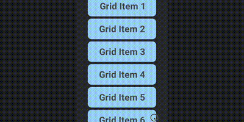 |
| **[Blocker](/api/components/base/blocker_api.md)** | Logic over GUI Node. Don't pass any user input below node area size. | [Blocker Example](https://insality.github.io/druid/?example=ui_example_basic_blocker) | 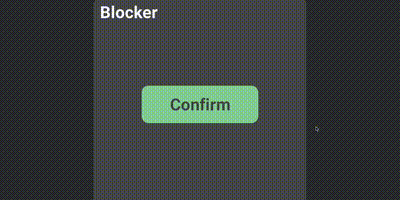 |
| **[Back Handler](/api/components/base/back_handler_api.md)** | Call callback on user "Back" action. It's a Android back button or keyboard backspace key | [Back Handler Example](https://insality.github.io/druid/?example=ui_example_basic_back_handler) | 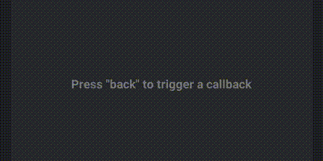 |
| **[Static Grid](/api/components/base/static_grid_api.md)** | Logic over GUI Node. Component to manage node positions with all equal node sizes. | [Static Gid Example](https://insality.github.io/druid/?example=ui_example_basic_grid) | 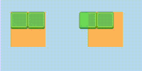 |
| **[Hover](/api/components/base/hover_api.md)** | Logic over GUI Node. Handle hover action over node. For both: mobile touch and mouse cursor. | [Hover Example](https://insality.github.io/druid/?example=ui_example_basic_hover) |  |
| **[Swipe](/api/components/extended/swipe_api.md)** | Logic over GUI Node. Handle swipe gestures over node. | [Swipe Example](https://insality.github.io/druid/?example=ui_example_basic_swipe) | 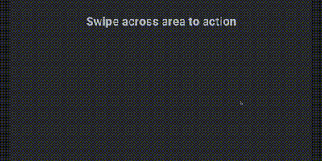 |
| **[Drag](/api/components/base/drag_api.md)** | Logic over GUI Node. Handle drag input actions. Can be useful to make on screen controlls. | [Drag Example](https://insality.github.io/druid/?example=ui_example_basic_drag) |  |
| **[Data List](/api/components/extended/data_list_api.md)** | Logic over Scroll and Grid components. Create only visible GUI nodes or components to make "infinity" scroll befaviour | [Data List Example](https://insality.github.io/druid/?example=ui_example_data_list_basic) | 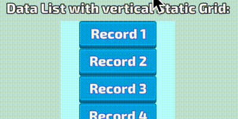 |
| **[Input](/api/components/extended/input_api.md)** | Logic over GUI Node and GUI Text (or Text component). Provides basic user text input. | [Input Example](https://insality.github.io/druid/?example=ui_example_basic_input) | 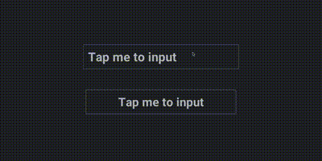 |
| **[Lang text](/api/components/extended/lang_text_api.md)** | Logic over Text component to handle localization. Can be translated in real-time with `druid.on_language_change` | [Lang Text Example](https://insality.github.io/druid/?example=ui_example_window_language) |  |
| **[Progress](/api/components/extended/progress_api.md)** | Logic over GUI Node. Handle node size and scale to handle progress node size. | [Progress Example](https://insality.github.io/druid/?example=ui_example_basic_progress_bar) | 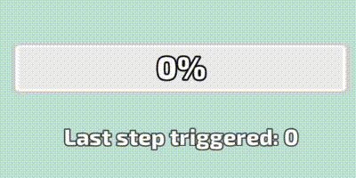 |
| **[Slider](/api/components/extended/slider_api.md)** | Logic over GUI Node. Handle draggable node with position restrictions. | [Slider Example](https://insality.github.io/druid/?example=ui_example_basic_slider) | 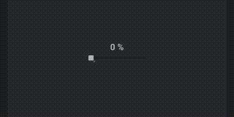 |
| **[Timer](/api/components/extended/timer_api.md)** | Logic over GUI Text. Handle basic timer functions. | [Timer Example](https://insality.github.io/druid/?example=ui_example_basic_timer) |  |
| **[Hotkey](/api/components/extended/hotkey_api.md)** | Allow to set callbacks for keyboard hotkeys with key modificators. | [Hotkey Example](https://insality.github.io/druid/?example=ui_example_basic_hotkey) | 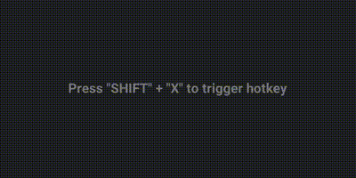 |
| **[Layout](/api/components/extended/layout_api.md)** | Logic over GUI Node. Arrange nodes inside layout node with margin/paddings settings. | [Layout Example](https://insality.github.io/druid/?example=ui_example_layout_basic) |  |
| **[Rich Input](/api/components/custom/rich_input_api.md)** | Logic over GUI Node and GUI Text (or Text component). Provides rich text input with different styles and text formatting. | [Rich Input Example](https://insality.github.io/druid/?example=ui_example_basic_rich_input) | 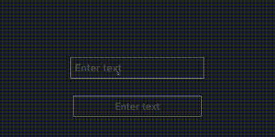 |
| **[Rich Text](/api/components/custom/rich_text_api.md)** | Logic over GUI Text. Provides rich text formatting with different styles and text formatting. | [Rich Text Example](https://insality.github.io/druid/?example=ui_example_basic_rich_text) | 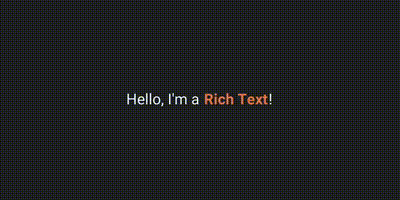 |


## Druid Events

All **Druid** components using [Defold Event](https://github.com/Insality/defold-event) for components callbacks. In component API ([button example](/api/components/base/button_api.md#fields)) pointed list of component events. You can manually subscribe to these events with the following API:

- **event:subscribe**(callback)

- **event:unsubscribe**(callback)

You can subscribe several callbacks to a single event.

Examples:

```lua
button.on_click:subscribe(function(self, args)
	print("Button clicked!")
end)

scroll.on_scroll:subscribe(function(self, position)
	print("Scroll scrolled!")
end)

input.on_input_unselect:subscribe(function(self, text)
	print("User enter input:", text)
end)
```


## Details

- **Druid** processes input in a stack-based manner. The most recently created button will be checked first. Create your input GUI components from back to front.
- Remember to include `return` in the `on_input` function: `return self.druid:on_input()`. This is necessary if you have multiple input sources (multiple Druid instances, other input systems, etc.).
- Druid automatically calls `acquire_input_focus` if you have input components. Therefore, manual calling of `acquire_input_focus` is not required.
- When deleting a **Druid** component node, make sure to remove it using `druid:remove(component)`.

## Examples

Try the [**HTML5 version**](https://insality.github.io/druid/) of the **Druid** example app.

Each example page provides a direct link to the corresponding example code, making it easier for you to understand how to use **Druid**.

Or refer directly to the [**example folder**](https://github.com/Insality/druid/tree/develop/example) for code examples demonstrating how to use **Druid**.


## Documentation

You can find the full **Druid** functions at [Quick API Reference](api/quick_api_reference.md)

To better understand **Druid**, read the following documentation:

- [How To GUI in Defold](https://forum.defold.com/t/how-to-gui-in-defold/73256)
- [Widgets](wiki/widgets.md)
- [Druid styles](wiki/styles.md)
- [Advanced Setup](wiki/advanced-setup.md)
- [Optimize Druid Size](wiki/optimize_druid_size.md)
- [Creating Custom Components](wiki/creating_custom_components.md)
- [Changelog](wiki/changelog.md)


## Licenses

This project is licensed under the MIT License - see the [LICENSE](LICENSE) file for details.


## Issues and suggestions

If you have any issues, questions or suggestions please [create an issue](https://github.com/Insality/druid/issues)


## History
For a complete history of the development of **Druid**, please check the [changelog](wiki/changelog.md).


## Contributors

Original Druid idea by [AGulev](https://github.com/AGulev)

Special thanks to all the contributors who have helped make **Druid** better!

<a href="https://github.com/Insality/druid/graphs/contributors">
  
</a>

Read the [CONTRIBUTING.md](CONTRIBUTING.md) file for more information.


## ❤️ Support project ❤️

Druid is developed and maintained by a single developer in his free time.

If this library helps your project, consider supporting my work ❤️

It really makes a difference.

[](https://github.com/sponsors/insality) [](https://ko-fi.com/insality) [](https://www.buymeacoffee.com/insality)
