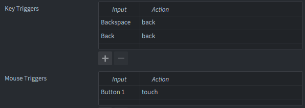

[](https://insality.github.io/druid/)

[](https://github.com/Insality/druid/releases)

**Druid** - powerful defold component UI library. Use basic **Druid** components or make your own game-specific components to make amazing GUI in your games.


## Setup

### Dependency

You can use the **Druid** extension in your own project by adding this project as a [Defold library dependency](https://www.defold.com/manuals/libraries/). Open your game.project file and in the dependencies field under project add:

> [https://github.com/Insality/druid/archive/master.zip](https://github.com/Insality/druid/archive/master.zip)

Or point to the ZIP file of a  [specific release](https://github.com/Insality/druid/releases).

### Input bindings

For **Druid** to work requires next input bindings:

-   Mouse trigger - `Button 1` -> `touch` _For basic input components_
-   Key trigger - `Backspace` -> `back`  _For back_handler component_
-   Key trigger - `Back` -> `back`  _For back_handler component, Android back button_




### Input capturing [optional]

By default, **Druid** will auto-capture input focus, if any input component will be created. So you don't need to call `msg.post(".", "acquire_input_focus)"`

If you not need this behaviour, you can disable it by settings `druid.no_auto_input` field in _game.project_:
```
[druid]
no_auto_input = 1
```

### Code [optional]

Adjust **Druid** settings, if needed:
```lua
local druid = require("druid.druid")

-- Used for button component and custom components
-- Callback should play sound by name
druid.set_sound_function(callback)

-- Used for lang_text component
-- Callback should return localized string by locale id
druid.set_text_function(callback)

-- Used for change default druid style
druid.set_default_style(your_style)
```


## Components

**Druid** provides next basic components:

- **[Button](https://github.com/Insality/druid/blob/master/docs_md/01-components.md#button)** - Basic Druid input component

- **[Text](https://github.com/Insality/druid/blob/master/docs_md/01-components.md#text)** - Basic Druid text component

- **Lang text** - Wrap on Text component to handle localization

- **Scroll** - Basic Druid scroll component

- **Progress** - Basic Druid progress bar component

- **Slider** - Basic Druid slider component

- **Input** - Basic Druid text input component (unimplemented)

- **Checkbox** - Basic Druid checkbox component

- **Checkbox group** - Several checkboxes in one group

- **Radio group** - Several checkboxes in one group with single choice

- **[Blocker](https://github.com/Insality/druid/blob/master/docs_md/01-components.md#blocker)** - Block input in node zone component

- **Back Handler** - Handle back button (Android back, backspace)

- **Timer** - Handle timer work on gui text node

- **Grid** - Component for manage node positions 

- **Hover** - System Druid component, handle hover node state

Full info see on _[components.md](https://github.com/Insality/druid/blob/master/docs_md/01-components.md)_


## Basic usage

For using **Druid**, first you should create Druid instance to spawn components. Pass to new Druid instance main engine functions: *update*, *on_message* and *on_input*

All **Druid** components as arguments can apply node name string, you can don't do `gui.get_node()` before

All **Druid** and component methods calling with `:` like `self.druid:new_button()`

```lua
local druid = require("druid.druid")

local function button_callback(self)
	print("Button was clicked!")
end

local function init(self)
	self.druid = druid.new(self)
	self.druid:new_button("button_node_name", button_callback)
end

function on_input(self, action_id, action)
	return self.druid:on_input(action_id, action)
end
```

## Druid Events

Any **Druid** components as callbacks uses [Druid Events](https://insality.github.io/druid/modules/druid_event.html). In component API ([button example](https://insality.github.io/druid/modules/druid.button.html#Events)) pointed list of component events. You can manually subscribe on this events by next API:

- **event:subscribe**(callback)

- **event:unsubscribe**(callback)

- **event:clear**()

Any events can handle several callbacks, if needed.


## Druid lifecycle

Here is full druid lifecycle setup in your ***.gui_script** file:
```lua
local druid = require("druid.druid")

function init(self)
	self.druid = druid.new(self)
end

function final(self)
	self.druid:final()
end

function update(self, dt)
	self.druid:update(dt)
end

function on_input(self, action_id, action)
	return self.druid:on_input(action_id, action)
end

function on_message(self, message_id, message, sender)
	self.druid:on_message(message_id, message, sender)
end
```

- *on_input* used for almost all basic druid components
- *update* used for progress bar, scroll and timer base components
- *on_message* used for specific druid events, like language change or layout change (TODO: in future)
- *final* used for custom components, what have to do several action before destroy

Recommended is fully integrate al druid lifecycles functions


## Features

- Druid input goes as stack. Last created button will checked first. So create your GUI from back
- Don't forget about `return` in `on_input`: `return self.druid:on_input()`. It need, if you have more than 1 acquire inputs (several druid, other input system, etc)


## Examples

See the [example folder](https://github.com/Insality/druid/tree/develop/example) for examples of how to use **Druid**

See the [druid-assets repository](https://github.com/insality/druid-assets) for examples of how to create custom components and styles

Try the [HTML5 version](https://insality.github.io/druid/druid/) of the example app


## Documentation

To learn **Druid** better, read next documentation:
- [Druid components](https://github.com/Insality/druid/blob/master/docs_md/01-components.md)
- [Create custom components](https://github.com/Insality/druid/blob/master/docs_md/02-creating_custom_components.md)
- [Druid styles](https://github.com/Insality/druid/blob/master/docs_md/03-styles.md)
- [Druid asset store](https://github.com/Insality/druid/blob/master/docs_md/04-druid_assets.md)

Full **Druid** documentation you can find here:
https://insality.github.io/druid/


## Games powered by Druid

_Will fill later_


## Future plans

- Basic input component

- Add on_layout_change support (to keep gui data between layout change)

- Add on_change_language support (call single function to update all Druid instance)

- Unit tests

- Better documentation and examples

- Add more comfortable gamepad support for GUI (ability to select button with DPAD and other stuff)


## License

Original created by [AGulev](https://github.com/AGulev)

Developed and supporting by [Insality](https://github.com/Insality)

Assets from [Kenney](http://www.kenney.nl/)

MIT License


## Issues and suggestions

If you have any issues, questions or suggestions please  [create an issue](https://github.com/Insality/druid/issues)  or contact me:  [insality@gmail.com](mailto:insality@gmail.com)
