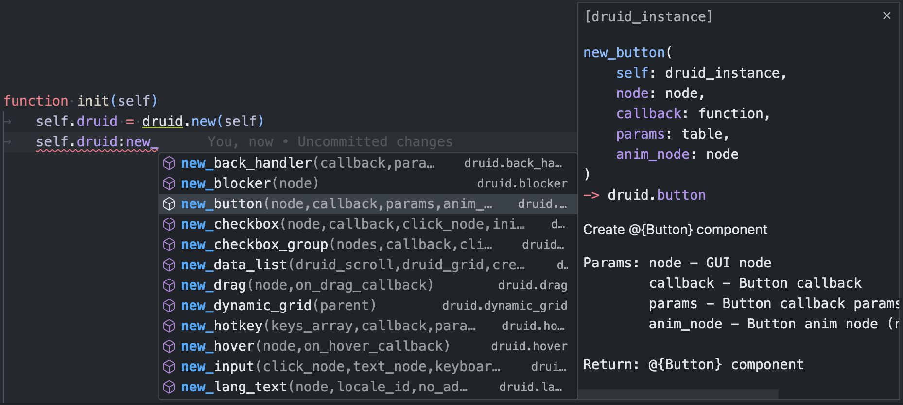
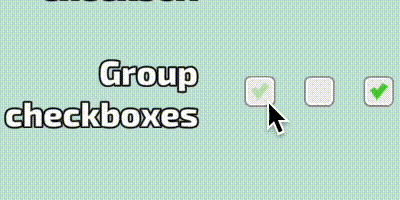
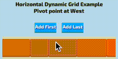

[](https://insality.github.io/druid/)

[](https://github.com/sponsors/insality) [](https://ko-fi.com/insality) [](https://www.buymeacoffee.com/insality)

[](https://github.com/Insality/druid/releases)
[](https://github.com/Insality/druid/actions)
[](https://codecov.io/gh/Insality/druid)

**Druid** - powerful Defold component UI framework. Use huge list of embedeed **Druid** components or make your own game-specific components with ease to make stunning and customizable GUI in your games.


## Setup

### Dependency

You can use the **Druid** extension in your own project by adding this project as a [Defold library dependency](https://www.defold.com/manuals/libraries/). Open your `game.project` file and in the dependencies field under project add:

**Druid v0.10.3**
> [https://github.com/Insality/druid/archive/refs/tags/0.10.3.zip](https://github.com/Insality/druid/archive/refs/tags/0.10.3.zip)

Here is a list of [all releases](https://github.com/Insality/druid/releases).

### Input Bindings
**Druid** uses `/builtins/input/all.input_binding` input bindings. For custom input bindings see the Input Binding section in **_[Advanced Setup](docs_md/advanced-setup.md)_**.

### Advanced Setup
In case you want to adjust **Druid** to your needs, you can use **_[Advanced Setup](docs_md/advanced-setup.md)_** section.


## Usage

### Basic usage

To use **Druid**, first you should create a **Druid** instance to spawn components and add Druids main functions: *update*, *final*, *on_message* and *on_input*.

All **Druid** components take node name string as argument. In in some cases you don't have the node name you can pass the `gui.get_node()` instead.

All **Druid** and component methods are called with `:` like `self.druid:new_button()`.

```lua
local druid = require("druid.druid")

-- All component callbacks pass "self" as first argument
-- This self is a context data passed in `druid.new(context)`
local function on_button_callback(self)
    print("The button clicked!")
end

function init(self)
    self.druid = druid.new(self)
    self.button = self.druid:new_button("button_node_name", on_button_callback)
end

-- Final is a required function for a correct Druid workflow
function final(self)
    self.druid:final()
end

-- The update used in progress bar, scroll and timer basic components
function update(self, dt)
    self.druid:update(dt)
end

-- The on_message used for specific Druid events, like language change or layout change
function on_message(self, message_id, message, sender)
    self.druid:on_message(message_id, message, sender)
end

-- The on_input used in almost all Druid components
function on_input(self, action_id, action)
    return self.druid:on_input(action_id, action)
end

```

For all **Druid** instance functions, [see here](https://insality.github.io/druid/modules/DruidInstance.html).


### API Documentation

**Druid** has a lot of components and functions. To make it easier to use, **Druid** has a full API documentation with examples and annotations.

Start read the API documentation [here](hhttps://insality.github.io/druid/modules/Druid.html).

### EmmyLua Annotations [optional]

[EmmyLua](https://emmylua.github.io/annotation.html) - annotations for Lua. It's a great tool for Lua code autocompletion in editors like [VSCode](https://github.com/EmmyLua/VSCode-EmmyLua), [IntelliJ IDEA](https://github.com/EmmyLua/IntelliJ-EmmyLua).

Since the dependencies can't be processed by external editors, for use generated EmmyLua annotations you should copy the _druid/annotations.lua_ to your project.

For EmmyLua it will be enough. Remember you can _restart emmylua server_ for refresh the changes, if something goes wrong.

After the annotations is processed, you should point the type of Druid in requires:
```lua
---@type druid
local druid = require("druid.druid")

-- Now the autocomplete is working
```



### Advanced Usage

If you looking for more advanced usage, see the [Advanced Usage](docs_md/advanced-usage.md) section.


### Create custom components

If you want to create your own components, see the [Create Custom Components](docs_md/create-custom-components.md) section.

The custom components is the most powerful feature of **Druid**. You can create your own components with ease and use it in your game.


## Druid Components

Here is full **Druid** components list.

### Basic Components

> Basic components always included in the build and available for use.

| Name | Description | Example | <div style="width:200px">Preview</div> |
|------|-------------|---------|---------|
| **[Button](https://insality.github.io/druid/modules/Button.html)** | Logic over GUI Node. Handle the user click interactions: click, long click, double click, etc. | [Button Example](https://insality.github.io/druid/druid/?example=general_buttons) |  |
| **[Text](https://insality.github.io/druid/modules/Text.html)** | Logic over GUI Text. By default Text component fit the text inside text node size area with different adjust modes. | [Text Example](https://insality.github.io/druid/druid/?example=texts_general) |  |
| **[Scroll](https://insality.github.io/druid/modules/Scroll.html)** | Logic over two GUI Nodes: input and content. Provides basic behaviour for scrollable content. | [Scroll Example](https://insality.github.io/druid/druid/?example=general_scroll) |  |
| **[Blocker](https://insality.github.io/druid/modules/Blocker.html)** | Logic over GUI Node. Don't pass any user input below node area size. | ❌ | |
| **[Back Handler](https://insality.github.io/druid/modules/BackHandler.html)** | Call callback on user "Back" action. It's a Android back button or keyboard backspace key | ❌ | |
| **[Static Grid](https://insality.github.io/druid/modules/StaticGrid.html)** | Logic over GUI Node. Component to manage node positions with all equal node sizes. | [Static Gid Example](https://insality.github.io/druid/druid/?example=general_grid) |  |
| **[Hover](https://insality.github.io/druid/modules/Hover.html)** | Logic over GUI Node. Handle hover action over node. For both: mobile touch and mouse cursor. | ❌ |  |
| **[Swipe](https://insality.github.io/druid/modules/Swipe.html)** | Logic over GUI Node. Handle swipe gestures over node. | [Swipe Example](https://insality.github.io/druid/druid/?example=general_swipe) |  |
| **[Drag](https://insality.github.io/druid/modules/Drag.html)** | Logic over GUI Node. Handle drag input actions. Can be useful to make on screen controlls. | [Drag Example](https://insality.github.io/druid/druid/?example=general_drag) |  |


### Extended components

> Extended components before usage should be registered in **Druid** with `druid.register()` function.

| Name | Description | Example | <div style="width:200px">Preview</div> |
|------|-------------|---------|---------|
| **[Checkbox](https://insality.github.io/druid/modules/Checkbox.html)** | Switch node state on click event. | [Checkbox Example](https://insality.github.io/druid/druid/?example=general_checkboxes) |  |
| **[Checkbox group](https://insality.github.io/druid/modules/CheckboxGroup.html)** | Group of checkbox components. | [Checkbox group Example](https://insality.github.io/druid/druid/?example=general_checkboxes) |  |
| **[Radio group](https://insality.github.io/druid/modules/RadioGroup.html)** | Like checkbox group but with single choise only. | [Radio Group Example](https://insality.github.io/druid/druid/?example=general_checkboxes) |  |
| **[Dynamic Grid](https://insality.github.io/druid/modules/DynamicGrid.html)** | Logic over GUI Node. Component to manage node positions with all different node sizes. Only one direction: horizontal or vertical. | [Dynamic Grid Example](https://insality.github.io/druid/druid/?example=general_grid) |  |
| **[Data List](https://insality.github.io/druid/modules/DataList.html)** | Logic over Scroll and Grid components. Create only visible GUI nodes or components to make "infinity" scroll befaviour | [Data List Example](https://insality.github.io/druid/druid/?example=general_data_list) |  |
| **[Input](https://insality.github.io/druid/modules/Input.html)** | Logic over GUI Node and GUI Text (or Text component). Provides basic user text input. | [Input Example](https://insality.github.io/druid/druid/?example=general_input) |  |
| **[Lang text](https://insality.github.io/druid/modules/LangText.html)** | Logic over Text component to handle localization. Can be translated in real-time with `druid.on_language_change` | ❌ |  |
| **[Progress](https://insality.github.io/druid/modules/Progress.html)** | Logic over GUI Node. Handle node size and scale to handle progress node size. | [Progress Example](https://insality.github.io/druid/druid/?example=general_progress_bar) |  |
| **[Slider](https://insality.github.io/druid/modules/Slider.html)** | Logic over GUI Node. Handle draggable node with position restrictions. | [Slider Example]() |  |
| **[Timer](https://insality.github.io/druid/modules/Timer.html)** | Logic over GUI Text. Handle basic timer functions. | ❌ |  |
| **[Hotkey](https://insality.github.io/druid/modules/Hotkey.html)** | Allow to set callbacks for keyboard hotkeys with key modificators. | [Hotkey Example](https://insality.github.io/druid/druid/?example=general_hokey) |  |
| **[Layout](https://insality.github.io/druid/modules/Layout.html)** | Logic over GUI Node. Handle node size depends on layout mode and screen aspect ratio. Contains helpers to build more complex UI layout. | [Layout Example](https://insality.github.io/druid/druid/?example=general_layout) |  |

For a complete overview, see: **_[components.md](docs_md/01-components.md)_**.


## Druid Events

Any **Druid** components as callbacks use [Druid Events](https://insality.github.io/druid/modules/DruidEvent.html). In component API ([button example](https://insality.github.io/druid/modules/Button.html#on_click)) pointed list of component events. You can manually subscribe to these events with the following API:

- **event:subscribe**(callback)

- **event:unsubscribe**(callback)

- **event:clear**()

You can subscribe several callbacks to a single event.

## Details

- **Druid** input goes as stack. Last created button will be checked first. Create your input GUI component from back to front.
- Don't forget about `return` in `on_input`: `return self.druid:on_input()`. It is required if you have more than 1 acquire inputs (several Druid, other input system, etc)
- Druid automatically call _acquire_input_focus_ if you have input components. So you don't required to call it manually.
- If you want to delete a **Druid** component node, don't forget to remove it via `druid:remove(component)`

[See full FAQ here](docs_md/FAQ.md)


## Examples

### HTML5 Live Examples

Try the [**HTML5 version**](https://insality.github.io/druid/druid/) of the **Druid** example app

Each example page has a link to the example code directly, so it will help you to faster understand how to use **Druid**


### Code examples

See the [**example folder**](https://github.com/Insality/druid/tree/develop/example) for examples of how to use **Druid**


## Documentation

To better understand **Druid**, read the following documentation:
- [Druid components](docs_md/01-components.md)
- [Create custom components](docs_md/02-creating_custom_components.md)
- [See FAQ article](docs_md/FAQ.md)
- [Druid styles](docs_md/03-styles.md)

You can fund the full **Druid** documentation here:
https://insality.github.io/druid/


## License

- Developed and supported by [Insality](https://github.com/Insality)
- Original idea by [AGulev](https://github.com/AGulev)
- Assets from [Kenney](http://www.kenney.nl/)


## Issues and suggestions

If you have any issues, questions or suggestions please [create an issue](https://github.com/Insality/druid/issues) or contact me: [insality@gmail.com](mailto:insality@gmail.com)


## ❤️ Support project ❤️

Your donation helps me stay engaged in creating valuable projects for **Defold**. If you appreciate what I'm doing, please consider supporting me!

[](https://github.com/sponsors/insality) [](https://ko-fi.com/insality) [](https://www.buymeacoffee.com/insality)
