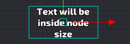
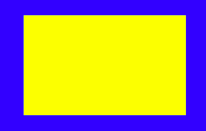
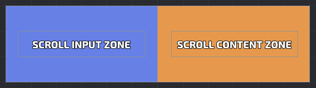
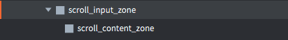

# Druid components

## Button
[Button API here](https://insality.github.io/druid/modules/Button.html)

### Overview
Basic Druid input component. Handle input on node and provide different callbacks on touch events.

### Setup
Create button with druid: `button = druid:new_button(node_name, callback, [params], [animation_node])`
Where node name is name of node from GUI scene. You can use `node_name` as input trigger zone and point another node for animation via `animation_node`

### Usecase
_fill example usecases_

### Notes
- Button callback have next params: (self, params, button_instance)
	- **self** - Druid self context
	- **params** - Additional params, specified on button creating
	- **button_instance** - button itself
- You can set _params_ on button callback on button creating: `druid:new_button("node_name", callback, params)`. This _params_ will pass in callback as second argument
- Button have next events:
	- **on_click** - basic button callback
	- **on_repeated_click** - repeated click callback, while holding the button, don't trigger if callback is empty
	- **on_long_click** - callback on long button tap, don't trigger if callback is empty
	- **on_hold_click** - hold callback, before long_click trigger, don't trigger if callback is empty
	- **on_double_click** - different callback, if tap button 2+ in row, don't trigger if callback is empty
- Click event will not trigger, if between pressed and released state cursor was outside of node zone
- If button have double click event and it is triggered, usual callback will be not invoked
- If you have stencil on buttons and you don't want trigger them outside of stencil node, you can use `button:set_click_zone` to restrict button click zone
- Button can have key trigger to use then by key: `button:set_key_trigger`
- Animation node can be used for example to animate small icon on big panel. Node name of trigger zone will be `big panel` and animation node will be `small icon`

## Text
[Text API here](https://insality.github.io/druid/modules/Text.html)

### Overview
Basic Druid text component. Text components by default have the text size adjusting.

### Setup
Create text node with druid: `text = druid:new_text(node_name, [initial_value], [is_disable_size_adjust])`

### Notes
- Text component by default have auto adjust text sizing. Text never will be bigger, than text node size, which you can setup in GUI scene. It can be disabled on component creating by settings argument `is_no_adjust` to _true_

- Text pivot can be changed with `text:set_pivot`, and text will save their position inside their text size box:

## Blocker
[Blocker API here](https://insality.github.io/druid/modules/Blocker.html)

### Overview
Druid component for block input. Use it to block input in special zone.

### Setup
Create blocker component with druid: `druid:new_blocker(node_name)`

### Notes
Explanation:

Blue zone is **button** with close_window callback

Yellow zone is blocker with window content

So you can do the safe zones, when you have the big buttons

## Back Handler
[Back handler API here](https://insality.github.io/druid/modules/BackHandler.html)

### Overview
Component to handle back button. It handle Android back button and Backspace key. Key triggers in `input.binding` should be setup for correct working.

### Setup
Setup callback with `druid:new_back_handler(callback)`

### Notes

## Lang text
[Lang text API here](https://insality.github.io/druid/modules/LangText.html)

### Overview
Wrap on Text component to handle localization. It uses druid get_text_function to set text by it's id

### Setup
Create lang text component with druid `text = druid:new_lang_text(node_name, locale_id)`

### Notes

## Scroll
[Scroll API here](https://insality.github.io/druid/modules/Scroll.html)

### Overview
Basic Druid scroll component. Handle all scrolling stuff in druid GUI

### Setup
Create scroll component with druid: `scroll = druid:new_scroll(view_node, content_node)`.

_View_node_ - is static part. It capturing user input and recognize scrolling touches

_Content_node_ - is dynamic part. This node will change position by scroll system

Initial scroll size will be equal to _content_node_ node size. The initial view box will be equal to _view_node_ node size

Usually, Place _view_node_ and as children add _content_node_:

*Here content_node below view_node, in game content_node be able to scroll left until end*

### Notes
- Scroll by default style have inertion and extra size for strecthing effect. It can be adjust via scroll [style settings](https://insality.github.io/druid/modules/Scroll.html#Style)
- You can setup "points of interest". Scroll always will be centered on closes point of interest. It is able to create slider without inertion and points of interest on each scroll element.
- Scroll have next events:
	- *on_scroll* (self, position) On scroll move callback
	- *on_scroll_to* (self, position, is_instant) On scroll_to function callback
	- *on_point_scroll* (self, item_index, position) On scroll_to_index function callback
- You can adjust scroll content size by `scroll:set_size(node_size)`. It will setup new size to _content node_
- You can enabled or disable inertion mode via `scroll:set_intert(state)`
- You can adjust extra stretch size via `scroll:set_extra_stretch_size`
- Multitouch is required for scroll. Scroll is correctly handling touch_id swap while dragging scroll

## Progress
[Progress API here](https://insality.github.io/druid/modules/Progress.html)

### Overview
Basic Druid progress bar component

### Setup
Create progress bar component with druid: `progress = druid:new_progress(node_name, key, init_value)`

Node name should have maximum node size, so in GUI scene, node_name should be fully filled. 
Key is value from druid const: const.SIDE.X (or just "x") or const.SIDE.Y (or just "y")

### Notes
- Progress correct working with 9slice nodes, it trying to set size by _set_size_ first, if it is not possible, it set up sizing via _set_scale_
- Progress bar can fill only by vertical or horizontal size. If you want make diagonal progress bar, just rotate node in GUI scene
- If you have glitchy or dark texture bug with progress bar, try to disable mipmaps in your texture profiles

## Slider
[Slider API here](https://insality.github.io/druid/modules/Slider.html)

### Overview
Basic Druid slider component

### Setup
Create slider component  with druid: `slider = druid:new_slider(node_name, end_pos, callback)`

Pin node (node_name in params) should be placed in zero position (initial). It will be available to mode Pin node between start pos and end pos. 

### Notes
- You can setup points of interests on slider via `slider:set_steps`. If steps are exist, slider values will be only from this steps (notched slider)
- For now, start pos and end pos should be on vertical or horizontal line (their x or y value should be equal)

## Input
[Input API here](https://insality.github.io/druid/modules/Input.html)

### Overview
Basic Druid text input component

### Setup
Create input component with druid: `input = druid:new_input(button_node_name, text_node_name, keyboard_type)`

### Notes
- Input component handle user text input. Input contains from button and text components. Button needed for selecting/unselecting input field
- Long click on input field for clear and select input field (clearing can be disable via styles)
- Click outside of button to unselect input field
- On focus lost (game minimized) input field will be unselected
- You can setup max length of the text
- You can setup allowed characters. On add not allowed characters `on_input_wrong` will be called. By default it cause simple shake animation
- The keyboard for input will not show on mobile HTML5. So input field in mobile HTML5 is not working now
- To make work different keyboard type, make sure value in game.project Android:InputMethod set to HidderInputField (https://defold.com/manuals/project-settings/#input-method)

## Checkbox
[Checkbox API here](https://insality.github.io/druid/modules/Checkbox.html)

### Overview
Basic Druid checkbox component.

### Setup
Create checkbox component with druid: `checkbox = druid:new_checkbox(node, callback)`

### Notes
- Checkbox uses button to handle click
- You can setup another node to handle input with click_node arg in component init: `druid:new_checkbox(node, callback, [click_node])`

## Checkbox group
[Checkbox group API here](https://insality.github.io/druid/modules/CheckboxGroup.html)

### Overview
Several checkboxes in one group

### Setup
Create checkbox_group component with druid: `group = druid:new_checkbox_group(nodes[], callback)`

### Notes
- Callback arguments: `function(self, checkbox_index)`. Index is equals in _nodes[]_ array in component constructor
- You can get/set checkbox_group state with `group:set_state()` and `group:get_state()`

## Radio group
[Radio group API here](https://insality.github.io/druid/modules/RadioGroup.html)

### Overview
Several checkboxes in one group with single choice

### Setup
Create radio_group component with druid: `group = druid:new_radio_group(nodes[], callback)`

### Notes
- Callback arguments: `function(self, checkbox_index)`. Index is equals in _nodes[]_ array in component constructor
- You can get/set radio_group state with `group:set_state()` and `group:get_state()`
- Only different from checkbox_group: on click another checkboxes in this group will be unchecked

## Timer
[Timer API here](https://insality.github.io/druid/modules/Timer.html)

### Overview
Handle timer work on gui text node

### Setup
Create timer component with druid: `timer = druid:new_timer(text_node, from_seconds, to_seconds, callback)`

### Notes
- Timer fires callback, when timer value equals to _to_seconds_
- Timer will set text node with current timer value
- Timer uses update function to handle time

## Static Grid
[Static Grid API here](https://insality.github.io/druid/modules/StaticGrid.html)

### Overview
Component for manage node positions.
Static grid have constant node size, so it possible to calculate node positions before placement. Nodes can be placed with gaps.
Static grid can shift elements on add/remove functions.

### Setup
Create  component with druid: `grid = druid:new_static_grid(parent_node, prefab_node, max_in_row_elements)`

### Notes
- On _add node_ grid will set nodeup parent to _parent_node_
- You can get array of position of every element for setup points of interest in scroll component
- You can get size of all elements for setup size in scroll component
- You can also bind the grid to the scroll component for auto resize scroll content size
- Pivot of parent_node matter for node placement
- _Prefab node_ used to get node size and anchor
- You can point *position_function* for animations with _static_grid:set_position_function(node, pos)_ callback. Default - *gui.set_position()*

## Dynamic Grid
[Dynamic Grid API here](https://insality.github.io/druid/modules/DynamicGrid.html)

### Overview
Component for manage node positions with different node sizes.
Unlike Static Grid, Dynamic Grid can place nodes only in one row or in one column.
Dynamic Grid can't have gaps between elements 
- you will get error, if try spawn element far away from others.
Dynamic Grid should have __West__, __East__, __South__ or __North__ pivot (vertical or horizontal element placement)

### Setup
Create component with druid: `grid = druid:new_dynamic_grid(parent_node)`

Check the _parent_node_ have correct pivot point. You will get the error otherwise.

### Notes
- On _add node_ grid will set node parent to _parent_node_
- You can get array of position of every element for setup points of interest in scroll component
- You can get size of all elements for setup size in scroll component
- You can also bind the grid to the scroll component for auto resize scroll content size
- Pivot of parent_node matter for node placement
- You can point *position_function* for animations with _static_grid:set_position_function(node, pos)_ callback. Default - *gui.set_position()*
- First node placed at Grid pivot point. Other nodes placed nearby of other nodes.
- On *add/remove* nodes always shifted. You can point the shift side in this functions (*is_shift_left* boolean argumentp

## Data List
[Data List API here](https://insality.github.io/druid/modules/DataList.html)

### Overview
Component to manage data for huge dataset in scroll. DataList create elements only in scroll view. 
It requires Druid Scroll and Druid Grid (Static or Dynamic) components

### Setup
Create component with druid: `grid = druid:new_data_list(scroll, grid, create_callback)`
- scroll - already created Scroll component
- grid - already created StaticGrid or DynamicGrid component
- create_function - your function to create node instances. This callback have next parameters: fun(self, data, index, data_list)
	- self - Script/Druid context
	- data- your element data
	- index - element index
	- data_list - current DataList component

Create function should return root node and optionaly, Druid component. It’s required to manage create/remove lifecycle.

### Notes
- Set data with `data_list:set_data({...})` after component initialize
- You can use `data_list:scroll_to_index()` function to show data element

## Hover
[Hover API here](https://insality.github.io/druid/modules/Hover.html)

### Overview
System Druid component, handle hover node state.

### Setup
Create hover component with druid: `hover = druid:new_hover(node, callback)`

### Notes
- By default, hover handles _hover event_ with pressed touch action_id. So it's mean, what mouse or touch have to be pressed
- On desktop platforms there is _on_mouse_hover_ event. It's event on mouse hover without any action id
- By default, assume what node is on not hovered state (both _hover_ and _mouse_hover_)

## Swipe
[Swipe API here](https://insality.github.io/druid/modules/Swipe.html)

### Overview
System Druid component, handle swipe actions on node

### Setup
Create swipe component with druid: `hover = druid:new_swipe(node, swipe_callback)`

### Notes
- Swipe callback have next params: (self, swipe_side, distance, time)
	- **self** - Druid self context
	- **swipe_side**: *string* - values from ["up", "down", "left", "right"]
	- **distance**: *number* - in pixels, distance of swipe
	- **time**: *number* - in seconds, time of swiping
- Swipe trigger only, if all input actions was on swipe node. If action will be outside of node, swipe status will be reseted
- In swipe style table you can adjust minimal distance and maximum time to trigg-  Hover state trigger only with touch on mobile devices or button mouse holding. Just mouse over swipe
- In swipe style table you can toggle type of swipe triggering. if SWIPE_TRIGGER_ON_MOVE setup to true - swipe will trigger as swipe can be triggered. If setup to false - swipe will trigger only on released action
- If you have stencil on swipe node and you don't want trigger it outside of stencil node, you can use `swipe:set_click_zone` to restrict swipe zonethout buttons is now not allowed.

## Drag
[Drag API here](https://insality.github.io/druid/modules/Drag.html)

### Overview
System Druid component, handle drag actions on node

### Setup
Create drag component with druid: `hover = druid:new_drag(node, drag_callback)`

### Notes
- Drag callback have next params: (self, swipe_side, distance, time)
	- **self**: Druid self context
	- **dx**: *number* - delta x position
	- **dy**: *number* - delta y position
- In styles, you can point the drag start deadzone. Default value is 10 pixels
- Drag correctly process multitouch. You can switch touch_id, while dragging on node with correct _dx_ and _dy_ values (made for correct scrolling)
- You can restrict horizontal or vertical dragging by setting `drag.can_x` or `drag.can_y` to _false_ value
- You can get info about current drag state:
	- _is_touch_ - Is currently node touching
	- _is_drag_ - Is currently node is dragging
	- _x_ and _y_ - Current touch position
	- _touch_start_pos_ - Touch stat positions
- Drag have next events:
	- _on_touch_start_ (self) - Event on touch start
	- _on_touch_end_ (self) - Event on touch end
	- _on_drag_start_ (self) - Event on drag start
	- _on_drag_ (self, dx, dy) - Event on drag process
	- _on_drag_end_ (self) - Event on drag end
- Drag node zone can be restricted via `drag:set_click_zone(node)`
