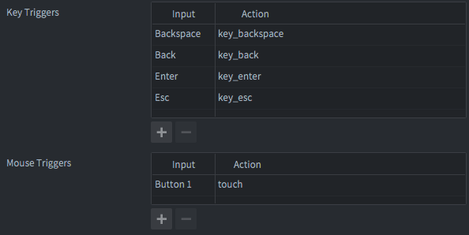

# Advanced Druid Setup

## Input Bindings

By default, **Druid** uses all key names from Defold's default `/builtins/input/all.input_binding` for input bindings.

**Druid** requires the following input bindings:

- Mouse trigger: `Button 1` -> `touch` (for basic input components)
- Mouse trigger: `Wheel up` -> `mouse_wheel_up` (for Scroll component)
- Mouse trigger: `Wheel down` -> `mouse_wheel_down` (for Scroll component)
- Key trigger: `Backspace` -> `key_backspace` (for BackHandler component, input component)
- Key trigger: `Back` -> `key_back` (for BackHandler component, Android back button, input component)
- Key trigger: `Enter` -> `key_enter` (for Input component, optional)
- Key trigger: `Esc` -> `key_esc` (for Input component, optional)
- Key trigger: `Left` -> `key_left` (for Rich Input component, optional)
- Key trigger: `Right` -> `key_right` (for Rich Input component, optional)
- Key trigger: `Shift` -> `key_lshift` (for Rich Input component, optional)
- Key trigger: `Ctrl` -> `key_lctrl` (for Rich Input component, optional)
- Key trigger: `Super` -> `key_lsuper` (for Rich Input component, optional)
- Touch triggers: `Touch multi` -> `touch_multi` (for Scroll component)




## Changing Key Bindings

If you need to use your own key bindings or key names, you can modify them in your *game.project* file.

Here are the default values for key bindings:
```
[druid]
input_text = text
input_touch = touch
input_marked_text = marked_text
input_key_esc = key_esc
input_key_back = key_back
input_key_enter = key_enter
input_key_backspace = key_backspace
input_multitouch = touch_multi
input_scroll_up = mouse_wheel_up
input_scroll_down = mouse_wheel_down
input_key_left = key_left
input_key_right = key_right
input_key_lshift = key_lshift
input_key_lctrl = key_lctrl
input_key_lsuper = key_lsuper
```


## Input Capturing

By default, **Druid** automatically captures input focus if any input component is created. Therefore, you do not need to call `msg.post(".", "acquire_input_focus")`.

If you do not require this behavior, you can disable it by setting the `druid.no_auto_input` field in the _game.project_ file:
```
[druid]
no_auto_input = 1
```


## Set Sound Function

You can set the sound function to play sounds in the Druid components. Mostly used as a click sound for the buttons.

```lua
local druid = require("druid.druid")

-- The callback should play the sound by name: function(sound_id) ... end
druid.set_sound_function(function(sound_id)
    sound.play("/sounds#" .. sound_id)
end)
```


## Set Text Function

You can set the text function to get the localized string by locale ID.

```lua
local druid = require("druid.druid")

-- The callback should return the localized string by locale ID: function(locale_id) ... end
druid.set_text_function(function(locale_id)
    -- return lang.get(locale_id)
end)
```


## Set Default Style

You can set the default style for the Druid components.

```lua
-- Copy the default style from the Druid folder and modify it as needed
local my_custom_style = require("my.custom.style")
local druid = require("druid.druid")

druid.set_default_style(my_custom_style)
```


## On Language Change

You can set the function to be called when the language changes.

```lua
local lang = require("lang.lang")
local druid = require("druid.druid")

function M.next_language()
    lang.set_next_lang()
	-- When game language changes, call this function to retranslate all Druid components
    druid.on_language_change()
end
```


## On Window Callback

You can set the function to be called when the window event occurs.

```lua
local druid = require("druid.druid")

-- Initialize the window listener, will override the previous window listener
druid.init_window_listener()

-- Or call this function inside window.set_listener

-- The callback should be called when the window event occurs: function(event) ... end
window.set_listener(function(self, event)
	druid.on_window_callback(event)
end)
```
