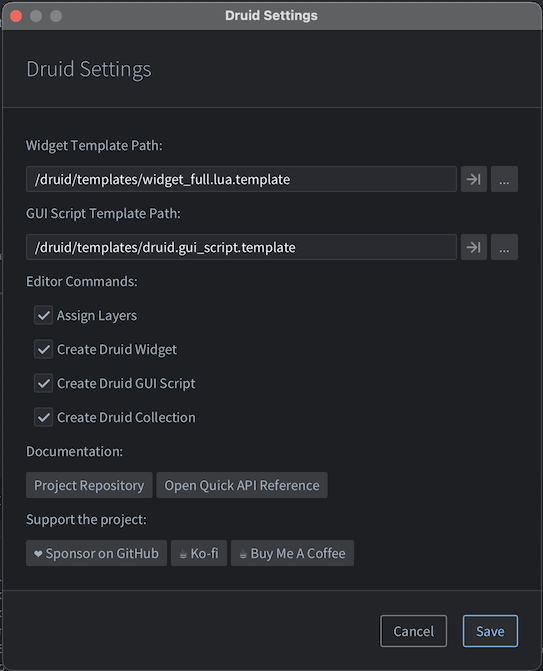

# Druid Settings

Open **Edit → [Druid] Settings** to configure the Druid editor extension: template paths, which editor commands appear in the menu, and quick links to docs and support.

## Template Path Settings

Paths used when creating new Druid assets from the editor.

- **Widget Template Path** — Template for new Druid widgets. Default: `/druid/templates/widget_full.lua.template`. A minimal alternative is `/druid/templates/widget.lua.template` if you already know how to work with Druid. Use the arrow button to open the file, or the ellipsis to pick another path.
- **GUI Script Template Path** — Template for new Druid GUI scripts. Default: `/druid/templates/druid.gui_script.template`. Same buttons for open/browse.

Change these if you use custom templates or a different project layout.

## Editor Commands

Checkboxes control which Druid commands appear in the editor:

- **Assign Layers** — Run from **Edit → [Druid]** while a GUI file (`.gui`) is open. Automatically assigns layers based on the textures and fonts used in that GUI scene.
- **Create Druid Widget** — Right-click a `.gui` file in the **Asset** pane → **[Druid] → Create Druid Widget**. Creates a `.lua` file next to the GUI file.
- **Create Druid GUI Script** — Right-click a `.gui` file → **[Druid] → Create Druid GUI Script**. Creates a `.gui_script` next to the GUI file and attaches it to the GUI.
- **Create Druid Collection** — Right-click a `.gui` file → **[Druid] → Create Druid Collection**. Creates a collection with this GUI file attached.

Uncheck any you don’t use to keep the menus minimal.

## Documentation

- **Project Repository** — Opens the Druid project repository in your browser.
- **Open Quick API Reference** — Opens the quick API reference (e.g. `api/quick_api_reference.md`) in the editor or default app.

## Support the project

Buttons to support Druid:

- [**Sponsor on GitHub**](https://github.com/sponsors/Insality)
- [**Ko-fi**](https://ko-fi.com/insality)
- [**Buy Me A Coffee**](https://www.buymeacoffee.com/insality)

Use **Save** to apply changes, or **Cancel** to discard.
